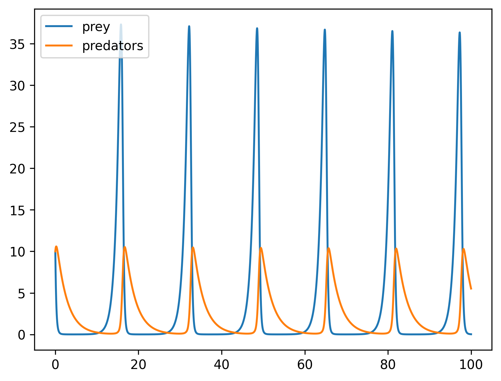

# Pitch

This package makes it easy to specify any physical system that can be written in terms of reactions that convert reactants to products. What's nice about this solution is that
1. you don't have to think about how will you simulate the model while you're specifying it
2. but when you do go to simulate, the right choices have been made to make it easy

Here's an example of specifying a [Lotka-Volterra](https://en.wikipedia.org/wiki/Lotka–Volterra_equations) predator prey model:

```python
import scipy.integrate
import matplotlib.pyplot as plt
from reactionmodel.model import Species, Model, Reaction

## Model is specified
prey = Species('Prey')
predator = Species('Predator')

reactions = []
reactions.append(Reaction([prey], [(prey, 2)], k="alpha", description="prey birth"))
reactions.append(Reaction([prey, predator], [predator], k="beta", description="prey death"))
reactions.append(Reaction([predator, prey], [(predator, 2)], k="delta", description="predator birth"))
reactions.append(Reaction([predator], [], k="gamma", description="predator death"))

m = Model([prey, predator], reactions)

## Now I want to simulate it
parameters = {
    'alpha': 1.1,
    'beta': 0.4,
    'delta': 0.1,
    'gamma': 0.4
}

dydt = m.get_dydt_function(parameters=parameters)
result = scipy.integrate.solve_ivp(dydt, [0.0, 100.0], y0=[10.0, 10.0])
plt.plot(result.t, result.y.T)
```


# Installation

If you're already using [Poetry](https://python-poetry.org): run
```bash
poetry add git+https://github.com/tanderson11/reactionmodel.git
```

Otherwise, read on:

You should add `reactionmodel` as a requirement for your Python project and use `reactionmodel` to specify the model of your system while you use the rest of your code to simulate / test / explore the model. The pain free way of doing this is to use [Poetry](https://python-poetry.org) to manage your dependencies. Poetry manages Python "virtual environments" (i.e. isolated containers with different versions of Python and different collections of packages that won't clash with any other container).

## Installing Poetry

Mac OS:
```bash
brew install pipx
pipx ensurepath
pipx install poetry
```
Linux:
```bash
sudo apt update
sudo apt install pipx
pipx ensurepath
pipx install poetry
```
Windows:
```bash
scoop install pipx
pipx ensurepath
pipx install poetry
```

(Note: when you run these commands, you are aiming to install Poetry on your system -- not through another virtual environment manager like Anaconda.)

## Using Poetry

Now that you have Poetry installed, you may use it to manage Python environments on a per-project basis. Navigate to your project and initialize a poetry environment
```bash
cd project/
poetry init
```
Add your project's existing dependencies:
```bash
poetry add numpy
poetry add {whatever}
```
Finally install your project and all its dependencies in the environment
```bash
poetry install
```
Now to run your project code, prepend `poetry run` to any invocation of Python to let your command line know that you intend to run the version of Python managed by Poetry:
```bash
poetry run python my_project_code.py
```

## Adding `reactionmodel` as a dependency to your project

To any Python project managed by Poetry (see above), you can add `reactionmodel` as a dependency by running this command:
```bash
poetry add git+https://github.com/tanderson11/reactionmodel.git
```
Or by manually adding this line to your `pyproject.toml` file:
```toml
reactionmodel = { git = "https://github.com/tanderson11/reactionmodel.git" }
```
and subsequently running
```bash
poetry update
```

## Installing as a standalone package for development

If you want to develop this package further rather than using it in the context of a project, simply clone it and install dependencies with Poetry:
```
git clone https://github.com/tanderson11/reactionmodel.git
cd reactionmodel/
poetry install
```